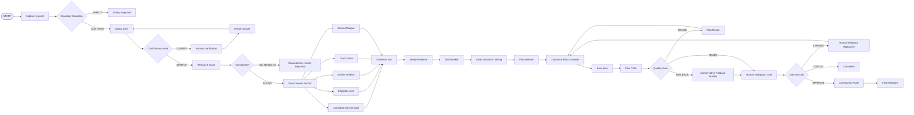

# AidCompass — an ADK 2.x graph agent for community-support navigation

AidCompass is a **community support navigator**. A user can describe a
messy real life situation in ordinary language. The system converts that story into a
profile, searches a curated resource store, evaluates
eligibility and access barriers in parallel, ranks matches transparently, builds Plan A
and Plan B, audits the plan, and pauses for human approval before finalizing it.

> **Demo-data boundary:** every bundled organization is synthetic. Replace the JSONL
> records with verified official local data before real-world use.

## What gives the project a “wow” factor

- **No-wrong-door intake:** the user tells a story instead of choosing a government-style category.
- **Scout Swarm:** four specialists evaluate candidates concurrently and join their evidence.
- **Evidence Lock:** an LLM may write the plan, but a deterministic node restores every
  organization record from canonical ranked evidence before the plan can proceed.
- **Self-repair:** an adversarial critic can send the plan through a capped repair loop.
- **Safe degradation:** if repair still fails, the graph creates a conservative grounded
  fallback rather than accepting a risky plan or looping forever.
- **Live replanning:** at the Human Navigator Gate, the user can say “online only,”
  “after 5 PM,” or “no calls,” and the graph replans and audits again.
- **Community Pulse:** after approval, only taxonomy-level needs and gaps are logged for
  aggregate impact analysis; the raw story is not stored in analytics.

## Creative subagents and graph components

| Component | Kind | Responsibility |
|---|---|---|
| **Boundary Guardian** | deterministic route node | Diverts immediate-danger requests and flags unnecessary contact details. |
| **Signal Lens** | LLM graph node | Turns a free-form story into needs, urgency, barriers, preferences, strengths, and minimal clarification questions. |
| **Resource Scout** | deterministic node | Searches only curated records and applies location, age, mode, cost, and keyword filters. |
| **Eligibility Lens** | LLM graph node | Interprets supplied eligibility rules using cautious labels; never guarantees acceptance. |
| **Barrier Breaker** | LLM graph node | Finds transportation, documentation, schedule, language, accessibility, digital, cost, and contact barriers. |
| **Trust Radar** | deterministic node | Scores source type, freshness, and record completeness. |
| **Access Mapper** | deterministic node | Scores distance, delivery mode, language, and accessibility fit. |
| **Matchmaker** | deterministic node | Produces an explainable weighted ranking. |
| **Plan Weaver** | LLM graph node | Creates one best first step, Plan A, a genuinely different Plan B, a document backpack, and outreach drafts. |
| **Canonical Plan Grounder** | deterministic invariant node | Removes invented resource IDs and restores immutable resource facts after every LLM plan or revision. |
| **Plan Critic** | LLM graph node | Audits grounding, privacy, uncertainty, barrier coverage, and actionability. |
| **Plan Repair** | LLM graph node | Applies only the critic’s required changes. |
| **Conservative Fallback Builder** | deterministic node | Replaces a plan that still fails after two repairs with a source-checked minimal plan. |
| **Human Navigator Gate** | resumable HITL node | Lets the user approve, cancel, or request a constraint change. |
| **Human-Feedback Replanner** | LLM graph node | Adapts the existing plan without introducing new resources. |
| **Community Pulse** | deterministic node | Logs anonymized need, barrier, and unmet-service categories. |
| **Final Renderer** | deterministic node | Produces the user-facing response from the approved typed plan. |

## ADK 2.x graph



The graph deliberately uses **typed `Event.output` for node-to-node payloads** and
session state only for information that must survive an interruption or loop:
`pending_profile`, `latest_ranking`, `latest_plan`, `pending_plan`, and the final plan.

## Repository layout

```text
aidcompass_adk2/
├── aidcompass/
│   ├── __init__.py
│   ├── agent.py                    # root_agent + resumable ADK App
│   ├── graph.py                    # Workflow nodes, routes, joins, and loops
│   ├── schemas.py                  # Pydantic contracts for every graph boundary
│   ├── prompts.py                  # complete prompts for every LLM subagent
│   ├── callbacks.py                # lightweight per-agent timing trace
│   ├── config.py                   # model and path settings
│   ├── skill_loader.py             # filesystem-backed SkillToolset factory
│   ├── subagents/
│   │   └── factory.py              # all LLM Agent definitions
│   ├── nodes/
│   │   ├── safety.py
│   │   ├── intake.py
│   │   ├── retrieval.py
│   │   ├── evidence.py
│   │   ├── ranking.py
│   │   ├── planning.py
│   │   ├── approval.py
│   │   ├── analytics.py
│   │   └── rendering.py
│   ├── tools/
│   │   ├── resource_store.py
│   │   ├── scoring.py
│   │   └── analytics_store.py
│   ├── skills/                     # eight progressive-disclosure skill packages
│   ├── data/                       # 18 synthetic resources + location index
│   └── evals/                      # scenarios, ADK EvalSet, config, manual rubric
├── docs/
│   ├── architecture.md
│   ├── graph.mmd
│   ├── demo-script.md
│   ├── subagent-contracts.md
│   └── vibe-coding-playbook.md
├── scripts/
│   ├── validate_project.py
│   ├── build_gap_report.py
│   └── export_graph.py
├── tests/                          # deterministic/no-model unit tests
├── pyproject.toml
├── Makefile
└── .env.example
```

# Skill folder design

AidCompass treats a skill as a reusable capability package, not merely a prompt file.
Every skill uses three levels of progressive disclosure:

1. **Discovery:** YAML frontmatter in `SKILL.md` tells the agent when the skill applies.
2. **Instructions:** the `SKILL.md` body gives the operating procedure and constraints.
3. **Resources:** references, machine-readable assets, and small scripts are loaded only
   when needed.

```text
aidcompass/skills/<skill-name>/
├── SKILL.md                 # required metadata + concise procedure
├── references/              # deeper explanations and policy/rubric text
│   └── <topic>.md
├── assets/                  # JSON taxonomy, rubric, schema, or template
│   └── <artifact>.json
└── scripts/                 # deterministic validator/transform helper
    └── <helper>.py
```

## The eight filled skill packages

| Skill | `SKILL.md` purpose | Reference | Asset | Script |
|---|---|---|---|---|
| `story-to-needs` | Map an ordinary-language story to needs with minimal clarification. | Need taxonomy and category distinctions. | Search-term taxonomy JSON. | Validate mapped need fields and priority range. |
| `privacy-and-safety` | Minimize intake data and audit plans for unsafe or excessive details. | Data-minimization guide. | Sensitive-field allow/avoid lists. | Redact demo email and phone patterns. |
| `eligibility-explainer` | Compare supplied rules to the profile without promising eligibility. | Four-level uncertainty rubric. | Label-to-score mapping and standard disclaimer. | Check that every candidate received an assessment. |
| `barrier-busting` | Detect access obstacles and produce grounded alternatives. | Barrier-specific playbook. | Strategy map by barrier type. | Remove a blocked delivery mode from backup choices. |
| `trust-and-citations` | Keep claims traceable to resource records and express freshness. | Source-confidence rubric. | Freshness/source weights and required fields. | Calculate deterministic freshness score. |
| `action-plan-weaving` | Build the first step, Plan A, Plan B, and document backpack. | Plan shape and quality pattern. | Required plan fields and limits. | Validate fallback difference and draft count. |
| `warm-handoff` | Draft user-approved email, text, or call scripts without oversharing. | Contact-tone guide. | Reusable outreach templates. | Render a template with supplied values. |
| `community-gap-analysis` | Aggregate anonymous needs/barriers/unmet categories. | Analytics anonymization rules. | Allowed/forbidden event fields. | Aggregate category counts. |

Each subagent receives only the skills it needs through a filesystem-backed
`SkillToolset`; it can list and load the selected skill instructions and resources at
runtime.

# Set up and run

The project was validated against **Google ADK 2.5.0** and pins `google-adk>=2.5.0,<3`.
Python 3.10 or newer is required.

```bash
python -m venv .venv
source .venv/bin/activate          # Windows: .venv\Scripts\activate
pip install -e ".[dev]"
cp .env.example .env
```

Put a Google AI Studio key in `.env`, or configure Vertex AI credentials. The default
model is `gemini-3.5-flash`; change `AIDCOMPASS_MODEL` when another structured-output
model is available to your account.

Validate and test:

```bash
python scripts/validate_project.py
pytest
ruff check .
```

Launch ADK Web:

```bash
adk web .
```

Select **aidcompass**. Resumability is enabled in `aidcompass/agent.py`, allowing both
clarification and plan-approval interruptions to continue in the same session.

CLI alternative:

```bash
adk run aidcompass
```

# Competition demo

Start with:

```text
I’m 16 in Scarborough. I need free math help and food support this week. I can only
travel after 5 PM, I may not have photo ID, and I would rather email than call.
```

At the Human Navigator Gate, reply:

```text
Make it online-only and avoid phone calls.
```

The graph routes through the Human-Feedback Replanner, Canonical Plan Grounder, and
Plan Critic before returning to approval. Reply `APPROVE` to finalize.

For a three-minute narration, use `docs/demo-script.md`.

# Evaluation

No-model tests cover graph construction, safety routing, skill loading, resource search,
mode/location filtering, ranking, canonical plan restoration, conservative fallback,
and ADK eval-artifact validation.

Run the ADK multi-turn EvalSet after credentials are configured:

```bash
adk eval aidcompass/__init__.py \
  aidcompass/evals/aidcompass.evalset.json \
  --config_file_path aidcompass/evals/eval_config.json \
  --print_detailed_results
```

Evaluation assets include:

- five LLM-backed user-simulation scenarios;
- hallucination and safety criteria;
- a 16-point manual rubric covering grounding, understanding, barrier handling,
  actionability, uncertainty, privacy, human control, and replanning.

# Production boundary

The LLM does **not** own organization facts. Import official data using the
`ResourceRecord` schema and keep a `source_url` and `last_verified` date for every
record. Add scheduled record review, dead-link checks, persistent session storage,
encrypted analytics, and an administrator workflow before deployment.
